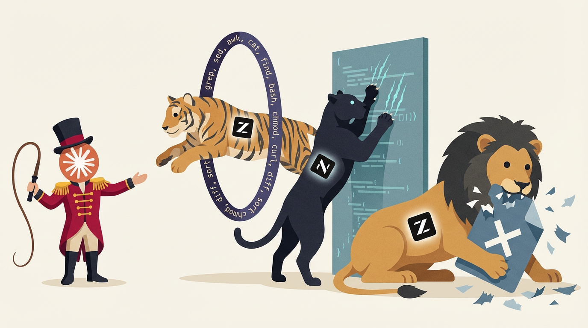

<p align="center">
  
</p>

<h1 align="center">PTSD</h1>

<p align="center">
  <strong>PRD &rarr; Seed &rarr; BDD &rarr; Tests &rarr; Implementation. Every feature earns its place.</strong>
</p>

<p align="center">
  CLI tool that enforces structured AI development with a strict pipeline.<br>
  No skipping stages. No orphan files. No vibes-based shipping.<br>
  Go. Single binary. Zero third-party dependencies.
</p>

---

## How It Works

After `ptsd init`, the tool hooks into Claude Code and **enforces the pipeline in real time** — every file edit is gate-checked, every stage advance is tracked, every commit is validated.

<p align="center">
  
</p>

1. **Session starts** — ptsd injects pipeline state: what feature is next, what stage it's at, what to do
2. **Every file edit** — gate-check blocks writes that violate pipeline order (no impl before tests)
3. **After every write** — auto-track advances the feature stage when artifacts are created
4. **On commit** — `ptsd validate` runs as pre-commit hook, blocks if anything is out of order

The LLM doesn't choose to follow the pipeline — it **can't not follow it**.

---

## Quick Start

### Install

Requires Go 1.25+

```bash
go install github.com/veschin/ptsd/cmd/ptsd@latest
```

Or build from source:

```bash
git clone https://github.com/veschin/ptsd.git && cd ptsd
go build -o ptsd ./cmd/ptsd
```

### Initialize

```bash
mkdir my-project && cd my-project
git init
ptsd init --name my-project
```

This generates everything:
- `.ptsd/` — config, feature registry, state, PRD template
- `.claude/settings.json` — 4 hooks wired to ptsd
- `.claude/hooks/` — shell scripts for gate-check, auto-track, context
- `.claude/skills/` — 13 pipeline skills for Claude Code auto-discovery
- `.git/hooks/` — pre-commit + commit-msg validation

### Work

```bash
# Add features
ptsd feature add auth "User Authentication"
ptsd feature status auth in-progress

# See what the AI should do next
ptsd context --agent
# next: auth stage=prd action=write-seed

# Work through the pipeline: PRD → seed → BDD → tests → impl
# Each stage = review with score ≥ 7 to pass
ptsd review auth seed 8

# Validate before commit
ptsd validate --agent
```

After `ptsd init`, start a Claude Code session. The hooks fire automatically — the LLM sees what to do, gets blocked if it tries to skip, and advances stages as it creates artifacts. You watch.

---

## Pipeline

Every feature moves independently through five stages in strict order:

| Stage | Gate | Artifact |
|---|---|---|
| **PRD** | `<!-- feature:id -->` anchor | `.ptsd/docs/PRD.md` |
| **Seed** | PRD anchor exists | `seeds/<id>/` |
| **BDD** | Seed exists | `bdd/<id>.feature` |
| **Tests** | BDD exists | `*_test.go` mapped to feature |
| **Impl** | Tests exist + pass | Source code |

Skip a stage — blocked. Miss a review — blocked. Score below 7 — redo.

## Claude Code Integration

`ptsd init` generates 4 hooks:

| Hook | Event | Effect |
|---|---|---|
| **Context** | SessionStart, UserPromptSubmit | Injects pipeline state — AI sees `next:`, `blocked:`, `done:` per feature |
| **GateCheck** | PreToolUse (Edit/Write) | Blocks writes that violate pipeline order |
| **AutoTrack** | PostToolUse (Edit/Write) | Advances feature stage on artifact creation |
| **commit-msg** | Git commit | Validates `[SCOPE] type:` format, checks staged files match scope |

Generated structure:
```
.claude/
  settings.json                    # 4 hook events → shell scripts
  hooks/
    ptsd-context.sh                # SessionStart + UserPromptSubmit
    ptsd-gate.sh                   # PreToolUse gate-check
    ptsd-track.sh                  # PostToolUse auto-track
  skills/<name>/SKILL.md           # 13 skills for auto-discovery
```

Token overhead: ~3-4% (~3K on a 100K session). Latency: ~100ms per hook.

## Commands

```bash
# Project setup
ptsd init [--name <name>]              # initialize .ptsd/, .claude/, git hooks
ptsd adopt                             # bootstrap onto existing project

# Features
ptsd feature add <id> <title>          # register feature
ptsd feature list                      # all features + status
ptsd feature status <id> <status>      # set status (planned/in-progress/done)

# Pipeline
ptsd seed add <feature>                # initialize seed data
ptsd bdd add <feature>                 # initialize BDD scenarios
ptsd prd check                         # validate PRD anchors
ptsd test map <feature> <test-file>    # map test to feature
ptsd test run <feature>                # run feature's tests
ptsd review <feature> <stage> <score>  # record review (0-10)
ptsd validate                          # check all pipeline gates

# Context & tracking
ptsd context --agent                   # pipeline state (next/blocked/done)
ptsd status                            # project overview
ptsd task next                         # next task

# Hooks (called by Claude Code, not manually)
ptsd hooks pre-tool-use                # gate-check via stdin
ptsd hooks post-tool-use               # auto-track via stdin
ptsd hooks validate-commit --msg-file <path>
```

## Project Structure

```
.ptsd/                                 # all artifacts (git-tracked)
  ptsd.yaml                            # config
  features.yaml                        # feature registry (source of truth)
  state.yaml                           # hashes, scores, test results
  review-status.yaml                   # per-feature: stage, tests, review, issues
  tasks.yaml                           # task queue
  issues.yaml                          # common issues registry
  docs/PRD.md                          # requirements with <!-- feature:id --> anchors
  seeds/<id>/                          # golden seed data per feature
  bdd/<id>.feature                     # Gherkin scenarios per feature
  skills/                              # pipeline skill docs
```

## Architecture

```
cmd/ptsd/main.go → internal/cli/* → internal/core/*
                                   → internal/render/*
```

| Package | Responsibility |
|---|---|
| `core/` | Domain logic — pipeline, validation, state, hooks. Zero TUI imports |
| `render/` | Output formatting — agent mode only (human TUI not yet implemented) |
| `cli/` | Glue: args → core → render. `func RunX(args []string, agentMode bool) int` |

Flat `switch` dispatcher in `main.go`. No cobra, no flag package. 18 commands.

All YAML parsing is hand-rolled in `core/` (line-by-line `strings.Split`/`HasPrefix`/`TrimPrefix`). Templates embedded via `//go:embed`.

## Exit Codes

| Code | Meaning |
|---|---|
| 0 | Success |
| 1 | Validation failure / pipeline violation |
| 2 | Bad arguments |
| 3 | Config error |
| 4 | I/O error |
| 5 | Test runner failure |

## Benchmarks

4 rounds of iterative testing. Each round exposed bypasses, fixes were applied, next round verified. By R4, Sonnet completed a 5-feature Go project on the first attempt with zero bypass attempts.

Test project: Go CLI task manager with intentional complexity traps — shared storage, cross-cutting features, vague PRD, multiple error paths.

| Round | Agent | Features | Pass Rate | What Happened |
|---|---|---|---|---|
| R1 | Sonnet 4.6 | 2 | — | **No hooks.** Found 4 bypasses: stage batching, fake reviews, structure divergence, global skills override |
| R2 | Sonnet 4.6 | 2 | 32/44 (73%) | **Hooks enabled.** Gates work (8/8). Found commit-msg scope bug + BYPASS-2 (direct review-status edits) |
| R3 | GLM-5 | 2 | 17/18 (94%) | **Post-fixes.** All R2 bypasses closed. Only skip: missing `ptsd review` in workflow skill |
| R4 | Sonnet 4.6 | 5 | 9/10 (90%) | **Full scale.** 21 tests, all green. Zero bypass attempts. Resolved vague PRD autonomously |

### R4 highlights (5-feature project, single session)

- **102K tokens, 182 tool calls, ~19 min** — full pipeline for 5 features
- **Hook overhead: ~3%** tokens, ~1% wall time — negligible
- **Zero bypass attempts** — Sonnet didn't try to skip stages or fake reviews (BYPASS-2 fix confirmed at scale)
- **Autonomous ambiguity resolution** — PRD said "tasks can have deadlines", Sonnet decided: ISO 8601 dates, `--due` flag, `OVERDUE` label, 5 BDD scenarios
- **Cross-cutting integration** — priority feature correctly touched add-task (flag) + list-tasks (sort) without guidance
- **21 integration tests**, all passing, realistic seed data ("Buy groceries", "Submit tax return"), no foo/test placeholders

### What the benchmarks prove

1. **Hooks work.** Gate-check blocked every out-of-order write across all rounds
2. **Iterative hardening works.** Each round found bypasses, fixes closed them, next round confirmed
3. **The LLM follows the pipeline because it can't not.** By R4, zero bypass attempts — not because the AI is obedient, but because the gates make bypassing harder than complying
4. **Token cost is negligible.** ~3K tokens overhead on a 100K session. Worth it for enforced structure

Full protocol, test plans, and per-round results: [FEEDBACK.md](FEEDBACK.md)
