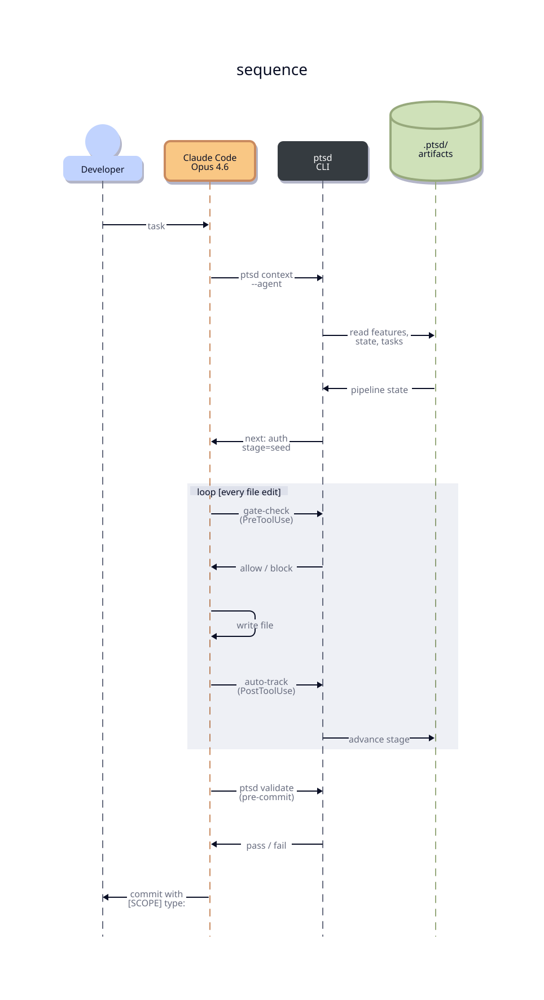

<p align="center">
  
</p>

<h1 align="center">PTSD</h1>

<p align="center">
  <strong>PRD &rarr; Tests &rarr; Implementation. Three pipeline profiles. Any AI tool. Any language.</strong>
</p>

<p align="center">
  CLI tool that enforces structured AI development.<br>
  Pipeline profiles: full, standard, lite. Choose what fits each feature.<br>
  Go. Single binary. Zero dependencies. Claude Code, OpenCode, Cursor.
</p>

---

## How It Works

After `ptsd init`, the tool hooks into your AI coding tool and **enforces the pipeline in real time** -- every file edit is gate-checked, every stage advance is tracked, every commit is validated.

<p align="center">
  
</p>

1. **Session starts** -- ptsd injects pipeline state: what feature is next, what stage it's at, what to do
2. **Every file edit** -- gate-check blocks writes that violate pipeline order (no impl before tests)
3. **After every write** -- auto-track advances the feature stage when artifacts are created
4. **On commit** -- `ptsd validate` runs as pre-commit hook, blocks if anything is out of order

The LLM doesn't choose to follow the pipeline -- it **can't not follow it**.

---

## Quick Start

### Install

Requires Go 1.25+

```bash
go install github.com/veschin/ptsd/cmd/ptsd@latest
```

If `@latest` returns a stale version (Go proxy caches ~30 min), pin the tag:

```bash
go install github.com/veschin/ptsd/cmd/ptsd@v2.0.0
```

Verify: `ptsd version`

Shell completion (optional):

```bash
# bash -- add to ~/.bashrc
eval "$(ptsd completion bash)"

# fish -- add to ~/.config/fish/config.fish
ptsd completion fish | source
```

Uninstall: `rm $(go env GOPATH)/bin/ptsd`. Per project: `rm -rf .ptsd/ .claude/ .git/hooks/pre-commit .git/hooks/commit-msg`

### Initialize

```bash
mkdir my-project && cd my-project
git init
ptsd init --tool claude    # or: opencode, generic
```

Project name defaults to the directory name. Use `--name <name>` to override -- this sets `project.name` in config and adds the binary to `.gitignore`.

This generates everything:
- `.ptsd/` -- config, feature registry, state, PRD template
- Tool-specific hooks (Claude: `.claude/`, OpenCode: `.opencode/`, Generic: `AGENTS.md` only)
- `.ptsd/skills/` -- 13 pipeline skills
- `.git/hooks/` -- pre-commit + commit-msg validation

### Work

```bash
# Add features with pipeline profiles
ptsd feature add auth "User Authentication" --pipeline full
ptsd feature add config "App Config" --pipeline lite
ptsd feature status auth in-progress

# See what the AI should do next
ptsd context --agent
# next: auth stage=prd action=write-seed pipeline=full
# next: config stage=prd action=write-tests pipeline=lite

# Work through the pipeline -- stages depend on profile
ptsd review auth prd 8

# Validate before commit
ptsd validate --agent
```

After `ptsd init`, start a Claude Code session. The hooks fire automatically -- the LLM sees what to do, gets blocked if it tries to skip, and advances stages as it creates artifacts. You watch.

---

## Pipeline Profiles

Every feature has a pipeline profile. Default: `standard`.

| Profile | Stages | Use For |
|---|---|---|
| **full** | PRD -> Seed -> BDD -> Tests -> Impl | Complex, data-heavy features |
| **standard** | PRD -> BDD -> Tests -> Impl | Default. Most features |
| **lite** | PRD -> Tests -> Impl | Simple utilities, config |

```bash
ptsd feature add auth "Auth" --pipeline full
ptsd feature pipeline auth lite    # change mid-flight
```

Gates are profile-aware -- lite features skip seed/BDD checks. Review rejects stages outside the profile.

## Tool Integration

`ptsd init --tool <name>` generates tool-specific hooks:

| Tool | What's Generated | Enforcement |
|---|---|---|
| **claude** | `.claude/hooks/` + `settings.json` + `skills/` + `CLAUDE.md` | Full: gate, track, context |
| **opencode** | `.opencode/plugins/ptsd.ts` + `commands/` + `AGENTS.md` | Full (plugin API unverified) |
| **generic** | `AGENTS.md` only | Advisory + git hooks |

Auto-detection: `.claude/` exists -> claude, `.opencode/` -> opencode, else -> claude.

Git hooks (all tools): `pre-commit` -> `ptsd validate`, `commit-msg` -> scope validation.

Token overhead: ~3-4% (~3K on a 100K session). Latency: ~100ms per hook.

## Commands

```bash
# Project setup
ptsd init [--tool claude|opencode|generic]  # initialize project
ptsd adopt [--dry-run]                      # bootstrap existing project
ptsd migrate                                # migrate v1 project to v2

# Features
ptsd feature add <id> <title> [--pipeline full|standard|lite]
ptsd feature list                           # all features + status + profile
ptsd feature status <id> <status>           # set status
ptsd feature pipeline <id> <profile>        # change pipeline profile

# Pipeline
ptsd seed init <feature>                    # initialize seed data (full only)
ptsd bdd add <feature>                      # create BDD scenarios (full/standard)
ptsd prd check                              # validate PRD anchors
ptsd test map <bdd-file> <test-file>        # map test via BDD
ptsd test map --feature <id> <test-file>    # map test directly (lite)
ptsd test run [feature]                     # run tests
ptsd review <feature> <stage> <score>       # record review (0-10)
ptsd validate                               # check all pipeline gates

# Context & tracking
ptsd context --agent                        # pipeline state (next/blocked/done)
ptsd status                                 # project overview
ptsd task next                              # next task

# Hooks (called by tool, not manually)
ptsd hooks pre-tool-use                     # gate-check via stdin
ptsd hooks post-tool-use                    # auto-track via stdin
ptsd hooks validate-commit --msg-file <path>
```

## Project Structure

```
.ptsd/                                 # all artifacts (git-tracked)
  ptsd.yaml                            # config
  features.yaml                        # feature registry (source of truth)
  state.yaml                           # hashes, scores, test results
  review-status.yaml                   # per-feature: stage, tests, review, issues
  tasks.yaml                           # task queue
  issues.yaml                          # common issues registry
  docs/PRD.md                          # requirements with <!-- feature:id --> anchors
  seeds/<id>/                          # golden seed data per feature
  bdd/<id>.feature                     # Gherkin scenarios per feature
  skills/                              # pipeline skill docs
```

## Architecture

```
cmd/ptsd/main.go -> internal/cli/* -> internal/core/*
                                   -> internal/render/*
```

| Package | Responsibility |
|---|---|
| `core/` | Domain logic -- pipeline, validation, state, hooks. Zero TUI imports |
| `render/` | Output formatting -- agent mode only (human TUI not yet implemented) |
| `cli/` | Glue: args -> core -> render. `func RunX(args []string, agentMode bool) int` |

Flat `switch` dispatcher in `main.go`. No cobra, no flag package. 23 commands.

All YAML parsing is hand-rolled in `core/` (line-by-line `strings.Split`/`HasPrefix`/`TrimPrefix`). Templates embedded via `//go:embed`.

## Polyglot

PTSD detects test files across languages: Go, TypeScript, JavaScript, Python, Ruby, Rust, Java, C#. Test runner auto-detected from project files (package.json, go.mod, pyproject.toml, Cargo.toml, Gemfile, pom.xml).

`ptsd adopt` discovers features from test file names in any supported language.

## Exit Codes

| Code | Meaning |
|---|---|
| 0 | Success |
| 1 | Validation failure / pipeline violation |
| 2 | Bad arguments |
| 3 | Config error |
| 4 | I/O error |
| 5 | Test runner failure |

## Benchmarks

4 rounds of iterative testing. Each round exposed bypasses, fixes were applied, next round verified. By R4, Sonnet completed a 5-feature Go project on the first attempt with zero bypass attempts.

Test project: Go CLI task manager with intentional complexity traps -- shared storage, cross-cutting features, vague PRD, multiple error paths.

| Round | Agent | Features | Pass Rate | What Happened |
|---|---|---|---|---|
| R1 | Sonnet 4.6 | 2 | -- | **No hooks.** Found 4 bypasses: stage batching, fake reviews, structure divergence, global skills override |
| R2 | Sonnet 4.6 | 2 | 32/44 (73%) | **Hooks enabled.** Gates work (8/8). Found commit-msg scope bug + BYPASS-2 (direct review-status edits) |
| R3 | GLM-5 | 2 | 17/18 (94%) | **Post-fixes.** All R2 bypasses closed. Only skip: missing `ptsd review` in workflow skill |
| R4 | Sonnet 4.6 | 5 | 9/10 (90%) | **Full scale.** 21 tests, all green. Zero bypass attempts. Resolved vague PRD autonomously |

### R4 highlights (5-feature project, single session)

- **102K tokens, 182 tool calls, ~19 min** -- full pipeline for 5 features
- **Hook overhead: ~3%** tokens, ~1% wall time -- negligible
- **Zero bypass attempts** -- Sonnet didn't try to skip stages or fake reviews (BYPASS-2 fix confirmed at scale)
- **Autonomous ambiguity resolution** -- PRD said "tasks can have deadlines", Sonnet decided: ISO 8601 dates, `--due` flag, `OVERDUE` label, 5 BDD scenarios
- **Cross-cutting integration** -- priority feature correctly touched add-task (flag) + list-tasks (sort) without guidance
- **21 integration tests**, all passing, realistic seed data ("Buy groceries", "Submit tax return"), no foo/test placeholders

### What the benchmarks prove

1. **Hooks work.** Gate-check blocked every out-of-order write across all rounds
2. **Iterative hardening works.** Each round found bypasses, fixes closed them, next round confirmed
3. **The LLM follows the pipeline because it can't not.** By R4, zero bypass attempts -- not because the AI is obedient, but because the gates make bypassing harder than complying
4. **Token cost is negligible.** ~3K tokens overhead on a 100K session. Worth it for enforced structure

Full protocol, test plans, and per-round results: [FEEDBACK.md](FEEDBACK.md)
