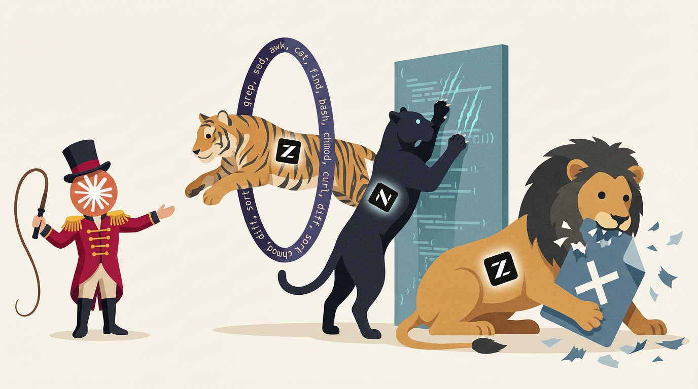

<p align="center">
  
</p>

<h1 align="center">PTSD</h1>

<p align="center">
  <strong>PRD &rarr; Tests &rarr; Implementation. Three pipeline profiles. Any AI tool. Any language.</strong>
</p>

<p align="center">
  CLI tool that enforces structured AI development.<br>
  Pipeline profiles: full, standard, lite. Choose what fits each feature.<br>
  Go. Single binary. Zero dependencies. Claude Code, OpenCode, Cursor.
</p>

<p align="center">
  <a href="https://veschin.github.io/ptsd/">Website</a> · <a href="https://github.com/veschin/ptsd">GitHub</a> · <a href="FEEDBACK.md">Benchmarks</a>
</p>

---

## Install

Requires Go 1.25+

```bash
go install github.com/veschin/ptsd/v2/cmd/ptsd@latest
```

If `@latest` returns a stale version (Go proxy caches ~30 min), pin the tag:

```bash
go install github.com/veschin/ptsd/v2/cmd/ptsd@v2.0.0
```

Verify: `ptsd version`

Shell completion (optional):

```bash
# bash -- add to ~/.bashrc
eval "$(ptsd completion bash)"

# fish -- add to ~/.config/fish/config.fish
ptsd completion fish | source
```

Uninstall: `rm $(go env GOPATH)/bin/ptsd`. Per project: `rm -rf .ptsd/ .claude/ .git/hooks/pre-commit .git/hooks/commit-msg`

## Quick Start

```bash
mkdir my-project && cd my-project
git init
ptsd init --tool claude    # or: opencode, generic
ptsd feature add auth "Auth" --pipeline full
ptsd feature status auth in-progress
ptsd context --agent       # see what to do next
```

After `ptsd init`, start a Claude Code session. Hooks fire automatically -- the LLM sees what to do, gets blocked if it tries to skip, and advances stages as it creates artifacts.

## Pipeline Profiles

Every feature has a pipeline profile. Default: `standard`.

| Profile | Stages | Use For |
|---|---|---|
| **full** | PRD -> Seed -> BDD -> Tests -> Impl | Complex, data-heavy features |
| **standard** | PRD -> BDD -> Tests -> Impl | Default. Most features |
| **lite** | PRD -> Tests -> Impl | Simple utilities, config |

## Tool Integration

| Tool | Enforcement |
|---|---|
| **Claude Code** | Full: gate, track, context via `.claude/hooks/` |
| **OpenCode** | Full: via `.opencode/plugins/ptsd.ts` |
| **Generic** | Advisory + git hooks |

## Polyglot

Test detection: Go, TypeScript, JavaScript, Python, Ruby, Rust, Java, C#.

Test runner auto-detected from project files (package.json, go.mod, pyproject.toml, Cargo.toml, etc).

## Commands

```bash
ptsd init [--tool claude|opencode|generic]
ptsd feature add <id> <title> [--pipeline full|standard|lite]
ptsd feature list
ptsd feature status <id> <status>
ptsd context --agent
ptsd status
ptsd validate
ptsd review <feature> <stage> <score>
ptsd test map --feature <id> <test-file>
ptsd adopt [--dry-run]
ptsd migrate
```

## Benchmark

8 runs, 2 models (Sonnet, [GLM-5 via GoLeM](https://github.com/veschin/GoLeM)), blind evaluation on identical spec.

| Model | Condition | Score | Tests | Commits |
|---|---|---|---|---|
| Sonnet | bare | 25.0/27 | 22 | 0-1 |
| Sonnet | PTSD | 24.5/27 | 26 | 4-8 |
| GLM-5 | bare | 20.5/27 | 9 | 1 |
| GLM-5 | PTSD | 20.0/27 | 24 | 8-13 |

PTSD doesn't make the first implementation better -- it makes the project developable. After a bare run you have code. After a PTSD run you have a feature registry, BDD specs, test mappings, review history, and stage-separated commits.

Full methodology: [FEEDBACK.md](FEEDBACK.md) | [Website](https://veschin.github.io/ptsd/)

## Exit Codes

| Code | Meaning |
|---|---|
| 0 | Success |
| 1 | Validation failure |
| 2 | Bad arguments |
| 3 | Config error |
| 4 | I/O error |
| 5 | Test runner failure |

## License

MIT
